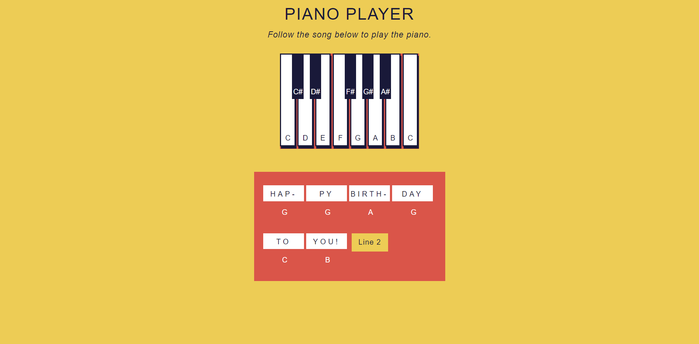

# Piano-Player
---

### **What is this about?**

This is about a interective piano website where user can find out the of piano of playing some common tunes such as like *<q> **Happy Birthday To you** </q>*.

To build this page we have used 

>HTML  
>CSS  
>JavaScript  

<figcaption style="display:flex;background-color:orange;color:black;margin:0 auto;width:15%;padding-left:10px;font-weight:900"> Our page</figcaption>